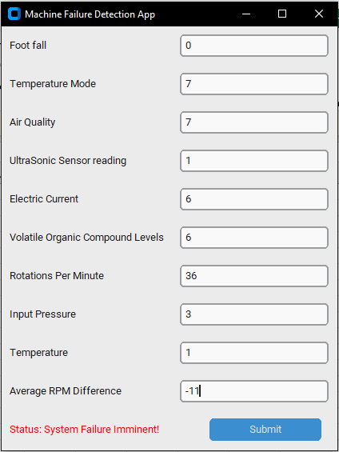
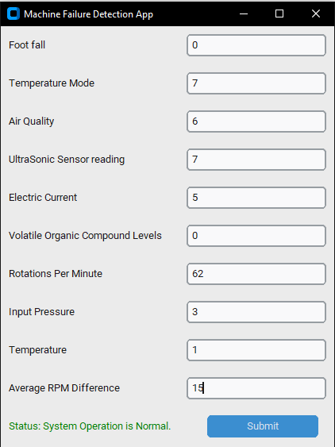

# Machine Failure Prediction System (Predictive Maintenance)

##  Project Summary

This project demonstrates the deployment of a machine learning classification model within a desktop application for **predictive maintenance**. The system utilizes sensor and operational data to predict the imminent failure of industrial machinery, allowing for timely, cost-effective intervention.

The core objective is to showcase a full-stack ML application: from model development (in the Jupyter Notebook) to production-ready deployment (in the Python GUI).

##  Key Components and Technologies

| Component | File / Dependency | Technical Role |
| :--- | :--- | :--- |
| **Model** | `model.pkl` | Pre-trained Random Forest Classifier. |
| **Application** | `Machine Detection app.py` | CustomTkinter GUI for user input and prediction display. |
| **Development** | `machine-failure-classification.ipynb` | Documents data cleaning, feature engineering, and model training. |
| **UI Framework** | `CustomTkinter` | Provides a modern, reliable graphical interface. |
| **Data Handling** | `Pandas` | Structures and prepares input data into the required feature format. |

##  Setup and Execution

### Prerequisites

Ensure you have Python 3.x installed. Install the necessary libraries using pip:

```bash
pip install customtkinter pandas scikit-learn
```

*(Note: `scikit-learn` is required to correctly load the `model.pkl` file.)*





### Repository Structure

To run the application, the following files must be in the same root directory:

```
.
├── Machine Detection app.py  
├── model.pkl               
└── README.md
```

### Running the Application

1.  Open your command line interface (CLI).

2.  Navigate to the project directory.

3.  Execute the main application file:

    ```bash
    python "Machine Detection app.py"
    ```

4.  The GUI will launch, prompting for sensor inputs.

##  Model Input and Feature Engineering

The application collects 10 raw inputs and then **engineers one critical feature** before feeding the data to the classifier. The model requires all 11 features to be present and in the correct order.

| Raw Input (GUI Label) | Feature Name (Model Column) | Description |
| :--- | :--- | :--- |
| Foot fall | `footfall` | Machine vibration or impact measurement. |
| Temperature Mode | `tempMode` | The target or set-point temperature of the operation. |
| Air Quality | `AQ` | Environmental quality reading. |
| UltraSonic Sensor reading | `USS` | Ultrasonic sensor measurement (e.g., distance or vibration). |
| Electric Current | `CS` | Electrical current consumption reading. |
| VOC Levels | `VOC` | Volatile Organic Compound concentration. |
| Rotations Per Minute | `RP` | Machine rotation speed in RPM. |
| Input Pressure | `IP` | Measured input pressure. |
| Temperature | `Temperature` | The actual current measured temperature. |
| Average RPM Difference | `RP_Avg` | An average deviation metric for rotation speed. |
| **Derived Feature** | `temp_diff` | **Calculated as:** `Temperature - tempMode`. This indicates thermal deviation. |

##  Troubleshooting Common Issues

| Issue Description | Probable Cause | Solution |
| :--- | :--- | :--- |
| **`FileNotFoundError`** | The script cannot locate `model.pkl`. | Ensure `model.pkl` is in the same directory as the script. |
| **Status: `System Info Inconclusive...`** | One or more input fields were empty or contained non-numeric text. | Ensure all 10 fields are filled with a numeric value (e.g., 0, 1.5, 100). |
| **Prediction Crash** | The data is not ordered correctly for the model. | Review the feature order in the `machine-failure-classification.ipynb` to ensure it exactly matches the `model_columns` list in the Python app. |
